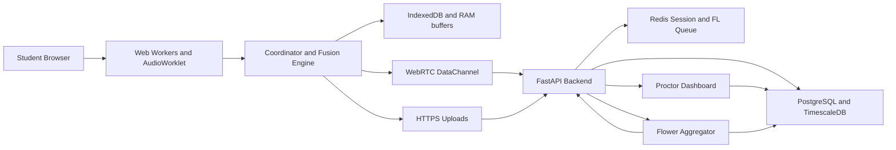

# BEZP Project Documentation

## 1. Project Purpose

Bandwidth-Equitable Zero-Transmission Proctoring, abbreviated BEZP, is a browser-based proctoring platform for online examinations. Its central design rule is simple: raw biometric data should remain on the student device. The system performs local edge inference, sends lightweight anomaly scores during the exam, uploads only event-triggered short video clips for human review, and improves the detection model through federated learning after exam sessions.

The system targets three outcomes:

- Reduce continuous monitoring bandwidth from commercial-proctoring scale video streams to sub-1 kbps anomaly score traffic.
- Preserve privacy by avoiding raw continuous video transmission and applying differential privacy to federated-learning updates.
- Improve exam equity by keeping the exam functional across degraded network states, including short offline windows.

## 2. Source Basis

This documentation is derived from:

- `D:\4th sem\federated learning\BEZP_Technical_Specification_v2 (1).docx`
- `D:\4th sem\federated learning\3. EL Synopsis format.docx`
- `D:\4th sem\federated learning\Experiential Learning Phase -1 Template - III Semester (1).pptx`

See [SOURCE_DOCUMENT_REVIEW.md](SOURCE_DOCUMENT_REVIEW.md) for the extracted requirements and methodology mapping.

## 3. System Scope

### In Scope

- Browser-based exam client with local Web Worker inference.
- Four probabilistic anomaly channels: pose/gaze, rPPG, facial action units, and keystroke dynamics.
- Deterministic rule layers for multiple people, phone objects, and background changes.
- Pre-exam verification, room scan, and calibration workflow.
- Two-stage fusion engine and tier classification.
- WebRTC DataChannel anomaly-score streaming.
- HTTPS upload for Tier 2 clips and federated-learning gradients.
- FastAPI backend with PostgreSQL, Redis, and Flower-based aggregation.
- Proctor dashboard for human review and verified labels.
- Tamper-evident audit records through hash chaining.
- Network-aware 4-gear degradation system.

### Out of Scope For Initial Phases

- Native lockdown browser features.
- Strong biometric identity proofing.
- Peer-to-peer federated learning.
- Byzantine-robust aggregation beyond validation gating.
- LMS-specific question layout integration until a target LMS is selected.

## 4. High-Level Architecture

## 5. Client Subsystems

### Exam Session

Controls the lifecycle: pre-exam, active exam, post-exam processing, and completion. It must keep the student experience stable even when monitoring components degrade.

### Coordinator

Collects worker outputs, normalizes channel scores, runs fusion, classifies tiers, writes local event records, and sends network updates.

### Channel Workers

- `PoseGazeWorker`: MediaPipe Pose, iris tracking, gaze heatmap, multi-person rule, phone detection, and background-difference support.
- `RppgWorker`: green-channel facial region signal extraction, FIR bandpass filtering, heart rate, and HRV deviation.
- `AuWorker`: MediaPipe Face Mesh landmark processing for sustained facial action unit signals.
- `KeystrokeWorker`: dwell time, flight time, correction rate, paste ratio, and rhythm-baseline comparison.
- `FlModelWorker`: frozen LSTM inference during exam and local post-exam training.

### Storage

IndexedDB stores local behavioral feature vectors, tier events, gear state, baselines, and queued transmissions. RAM stores rolling video buffers for Tier 2 clips only.

### Networking

- WebRTC unreliable DataChannel for anomaly scores because stale scores should be dropped rather than retransmitted.
- HTTPS POST for Tier 2 clips and gradient updates because these require reliable delivery.
- Service Worker for offline queueing and model cache management.

## 6. Server Subsystems

### FastAPI

Owns API routing, auth validation, schema validation, rate limiting, signaling, clip ingestion, telemetry ingestion, gradient ingestion, and proctor interactions.

### PostgreSQL With TimescaleDB

Stores exam sessions, anomaly events, gradient submissions, verified labels, global model versions, telemetry, and audit chains.

### Redis

Stores active session state, proctor dashboard cache, token buckets, FL round queues, and session-history priors.

### Flower Aggregation

Runs FedAvg-style aggregation with tiered deadlines, validates the new model against synthetic scenarios, and publishes accepted model versions.

## 7. Proctor Dashboard

The dashboard must support:

- Live session overview.
- Tier 2 review queue ordered by severity and age.
- 30-second clip review with anomaly timeline overlay.
- Decision capture: suspicious, not suspicious, escalate.
- Neutral intervention messages for sustained high-confidence events.
- Random review workflows for 5-10 percent of sessions.

## 8. Detection Model

### Probabilistic Channels

| Channel | Main Signal | Update Rhythm | Key Limitation |
| --- | --- | --- | --- |
| Pose and gaze | spatial attention, head orientation, fixation distribution | device-adaptive, target 10 FPS | content-aware gaze needs LMS layout metadata |
| rPPG | heart rate and HRV deviation from baseline | about every 10 seconds | consumer webcam signal is relative, not clinical |
| Facial AUs | sustained stress expressions | about 0.4 to 2 Hz | not micro-expression detection |
| Keystroke dynamics | typing rhythm and paste/correction behavior | every 30 seconds | cannot prove identity alone |

### Deterministic Rules

- More than one detected skeleton forces Tier 1.
- Phone object confidence above 0.70 forces Tier 1.
- Background difference above calibrated threshold forces a high-confidence event.

### Fusion

The coordinator calculates:

- Channel Agreement Index: standard deviation across channel scores.
- Weighted Mean Score: initially equal channel weights, later refined from verified labels.

Tier behavior:

- Tier 1: weighted mean above 0.85 with agreement below 0.15, or any deterministic rule.
- Tier 2: weighted mean above 0.60, or high disagreement on elevated scores.
- Tier 3: passive local log when score is below alert thresholds.

## 9. Network Gears

| Gear | Condition | Behavior |
| --- | --- | --- |
| Gear 1 | RTT below 50 ms and packet loss below 0.5 percent | full monitoring and normal sync |
| Gear 2 | RTT 50-150 ms or packet loss 0.5-2 percent | reduced refresh and gradient compression |
| Gear 3 | RTT 150-500 ms or packet loss 2-5 percent | lower inference rate, quantization, queued gradients |
| Gear 4 | RTT above 500 ms or packet loss above 5 percent | offline-first, critical alerts only, suspend after 5 minutes |

Gear transitions must use hysteresis: downgrade quickly, upgrade only after stable recovery.

## 10. Federated Learning

The LSTM model is frozen during the exam. After submission, the client trains locally on the full session dataset, computes the gradient delta, compresses it, clips it, adds Gaussian differential-privacy noise, and transmits it reliably.

Server aggregation triggers when either 50 submissions are available or 7 days have elapsed. Accepted model updates are versioned and broadcast to client service workers.

## 11. Security And Privacy

- TLS 1.3 for HTTPS endpoints.
- DTLS for WebRTC DataChannels.
- No continuous raw video transmission.
- RAM-only rolling clip buffer.
- IndexedDB for local session feature data.
- PostgreSQL audit hash chain for tamper evidence.
- Redis network isolation for ephemeral session state.
- Rate limiting per student session.
- Differential privacy on model updates.

## 12. Legal And Ethical Handling

- Disclose camera, microphone, keystroke timing, local inference, Tier 2 clip policy, and FL updates before exam start.
- Do not store key content, only timing metadata.
- Clearly state rPPG limitations and avoid clinical claims.
- Clearly state AU limitations and avoid unsupported micro-expression claims.
- Keep proctor intervention messages neutral and non-accusatory.

## 13. Current Repository State

This repository is ready for Phase 1 planning and implementation. It contains:

- Documentation scaffold.
- Environment setup file.
- Planned source directories.
- Testing and progress tracking structure.

No production implementation code has been added yet.
